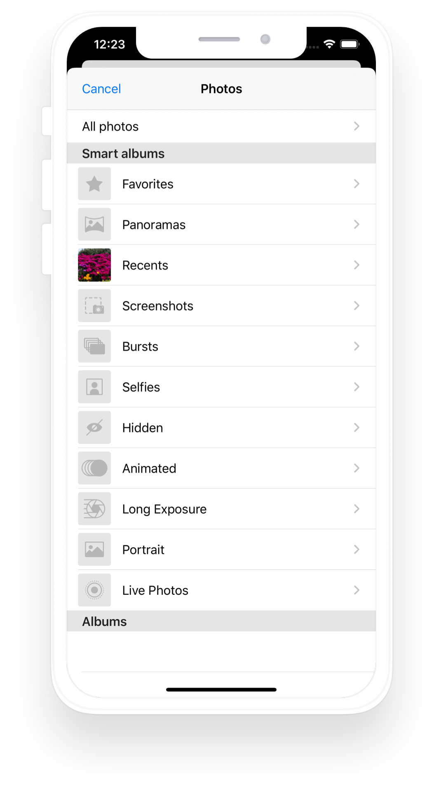
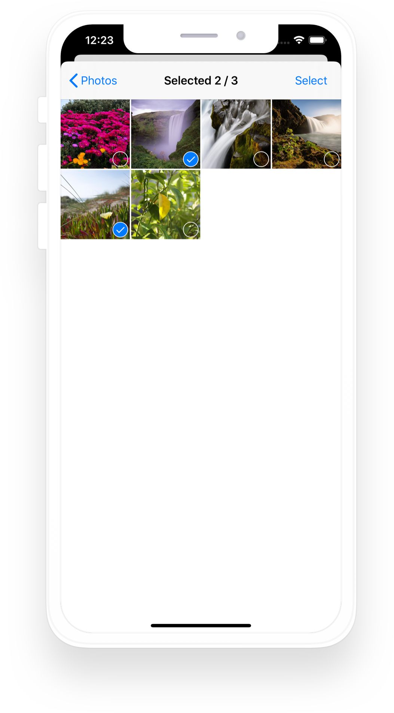

[](http://cocoapods.org/pods/ACKImagePicker)
[](https://github.com/Carthage/Carthage)
[](http://cocoapods.org/pods/ACKImagePicker)
[](http://cocoapods.org/pods/ACKImagePicker)

ACKImagePicker lets users choose multiple photos from different albums in their media library with a native-like appearance.

 

## Installation

### CocoaPods

ACKImagePicker is available through [CocoaPods](http://cocoapods.org). To install it, simply add the following line to your Podfile:

```ruby
pod "ACKImagePicker", "~> 0.3.3"
```


### Carthage

You can also use [Carthage](https://github.com/Carthage/Carthage). Specify this repo in your Cartfile:

```
github "AckeeCZ/ACKImagePicker" ~> 0.3.3
```

## Usage

Simply initalize `ACKImagePicker` and present it:
```swift
let controller = ACKImagePicker()
present(controller, animated: true)
```

To receive selected images, you can set `onImagesPicker` callback:
```swift
controller.onImagesPicked = { images in
    showImagesInMyController()
    // Dismiss `ACKImagePicker`
    dismiss(animated: true)
}
```

You can also limit number of images that an user can select by setting:
```swift
controller.maximumNumberOfImages = 3
```

## Author

[Ackee](https://ackee.cz) team

## License

ACKImagePicker is available under the MIT license. See the LICENSE file for more info.

[1]:	https://twitter.com/AckeeCZ
